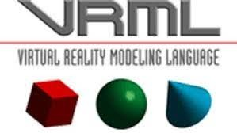
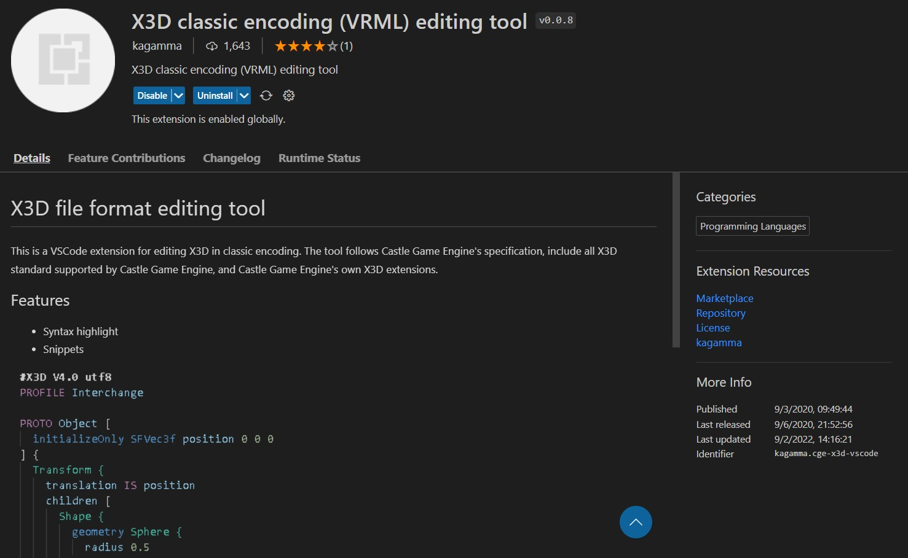

# VRML

VRML por sus siglas en inglés (Virtual Reality Modeling Languaje) es un lenguaje para la creación de entornos virtuales en tercera dimensión.



## Ejecución 

VRML puede ser ejecutado en dos plataformas principalmente:
 1. [FreeWRL](https://freewrl.sourceforge.io/)
 2. [Cortona3d](https://www.cortona3d.com/en/cortona3d-viewers-windows)
 
En mi experiencia personal si es que el mundo virtual no va a llevar ningún tipo de archivo adjunto puede usar FreeWRL, en caso contrario recomiendo Cortona 3d.

## Bibliografía

Algunos recursos que personalmente recomiendo para comenzar con VRML son:

Díaz, A. (n.d.). El Placer de Programar con VRML 2.0 Lenguaje de Modelación de Realidad Virtual Contenido.

[Enlace](http://www.geocities.ws/daraujo14/vrml_araujo.pdf)

Héctor, D., Rosso, S., & Rojas, S. (n.d.). MUNDOS VIRTUALES 3D MUNDOS VIRTUALES 3D CON VRML97 CON VRML97. 

[Enlace](http://www.lcc.uma.es/~galvez/ftp/libros/VRML97.pdf)

Actualmente a pesar de no ser muy usado, se sigue usando sobre todo en el ámbito académico donde no existe la suficiente información para poder comenzar con su uso.

## Editores de texto 

Existen dos formas de editar archivos VRML que tengan coloreado. 

 1. [VrmlPad](https://vrmlpad.softonic.com/) 

Personalmente no recomiendo esta opción, debido a que no existe un enlace oficial.

 2.  [Visual Studio Code (con extensiones)](https://code.visualstudio.com/)

De manera oficial VS Code no cuenta con soporte para poder editar archivos VRML con coloreado, entonces para ello recomiendo instalar la siguiente extensión:

[X3D classic encoding (VRML) editing tool](https://marketplace.visualstudio.com/items?itemName=kagamma.cge-x3d-vscode)
   Que ya cuenta con soporte para colorear el texto de VRML y autocompletado.



Cabe aclarar que esta extensión no es exclusiva de VRML, pero sirve para este mismo. 

## Extensión del documento VRML 

La extensión de los documentos VRML es:
>.wrl

## Formato del documento VRML 

El formato del documento es importante, dado a que nos ayuda a poder correrlo en cualquier software. Lo primero que debemos tener en cuenta es el encabezado del docuemento en este caso siempre debe comenzar de la siguiente forma, ya que si no es así podría dernos problema en algún software.

```
#VRML V2.0 utf8
```
Posterior a esto ya no es necesario que tengamos que tener una estructura definida, y podemos poner directamente los comandos. 


## Siguientes temas
+ [Figuras básicas](https://github.com/davi3004/VRML/blob/main/Intro/Temas/Figuras%20b%C3%A1sicas/README.md)
+ Texturas
+ Grupos
+ Movimiento
+ Sonido

